# auto_jobs_pipeline

A local, self-hosted job-hunting pipeline with a web dashboard:

```
Import → Hunt → Recommend → Tailor → Apply → Interview → Outcome
```

Upload your documents, scrape job boards by region, let Claude rank the postings against your profile, draft a tailored CV and cover letter per posting, submit, prepare for interviews, record outcomes, and see a career roadmap of where you are and what to level up. Everything runs on your machine in Docker; your documents and application history never leave it except through the Claude API calls you trigger.

> **Built on [MadsLorentzen/ai-job-search](https://github.com/MadsLorentzen/ai-job-search)** by Mads Lorentzen (MIT). That project provides the whole application framework this fork runs on: the `/setup`, `/scrape`, `/rank`, `/apply`, `/interview`, `/outcome` and `/upskill` Claude Code commands, the fit-evaluation rubric, the LaTeX CV and cover-letter templates with PDF and ATS verification, the drafter-reviewer workflow, and the portal-search CLIs. This fork adds the dashboard, the region-scoped hunt, the import and roadmap pages, and the browser auto-submit on top, and keeps upstream's files untouched so updates can be merged in. If the framework helps you, consider [supporting the upstream author](https://ko-fi.com/madslorentzen). Neither project is affiliated with Anthropic.

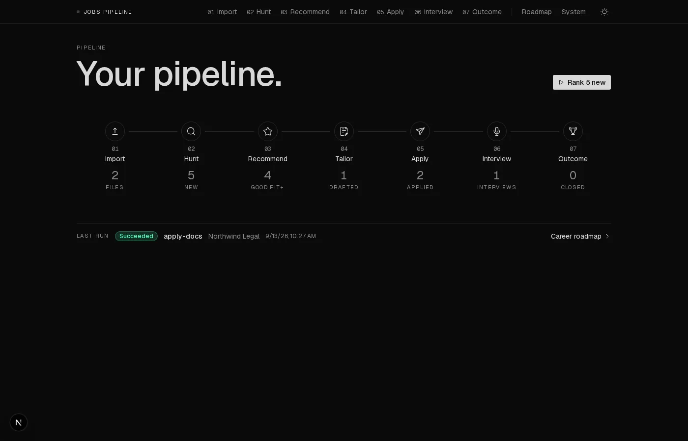

## What this fork adds

| Stage | What happens | Powered by |
|---|---|---|
| 01 Import | Upload CV, LinkedIn export, diplomas, references, past applications. Answer eight questions. One click runs upstream's `/setup` headless and shows your **current standing** (profile summary, completeness, remaining gaps). "Tailor hunt to my profile" turns your target titles and skills into search queries. | dashboard + `/setup` |
| 02 Hunt | Pick a **region**: which job boards, which cities or countries, which queries. One blank Remote region ships; add your own. Only that region's portals and locations are scraped, directly through the portal CLIs. No LLM cost. | dashboard + portal CLIs |
| 03 Recommend | Score new postings on technical, experience, behavioural and career fit. Ranked shortlist with strengths, gaps and vetoes. | `/rank` |
| 04 Tailor | Draft a tailored LaTeX CV and cover letter per posting, reviewed by a second agent, compiled and checked for layout and ATS parseability. | `/apply` |
| 05 Apply | Auto-submit through the portal with Playwright (LinkedIn Easy Apply, JobStreet), dry-run by default, screenshots of every step. Or apply by hand and mark it applied. | dashboard |
| 06 Interview | Stage-specific prep pack from the posting, the documents you sent and earlier feedback. | `/interview` |
| 07 Outcome | Record interviews, offers, rejections; archive what you sent. | `/outcome` |
| Roadmap | Past roles → now → two or three next roles with readiness, the skills to level up, and quarterly milestones, drawn from your profile and the gaps found while ranking. | dashboard prompt |
| System | Every run with its live log, tool health, regions and portals, browser login. The one technical page. | dashboard |

## Screenshots

Every capture below uses synthetic demo data: fictional companies, and a fictional "Jane Doe" corporate-law profile. Nothing here is a real person or posting. The tool itself is field-agnostic; the demo happens to be legal and business development to make that point.

| | |
|---|---|
| **Import**: upload per folder, answer the eight questions, analyse | **Current standing** parsed from the generated profile |
| 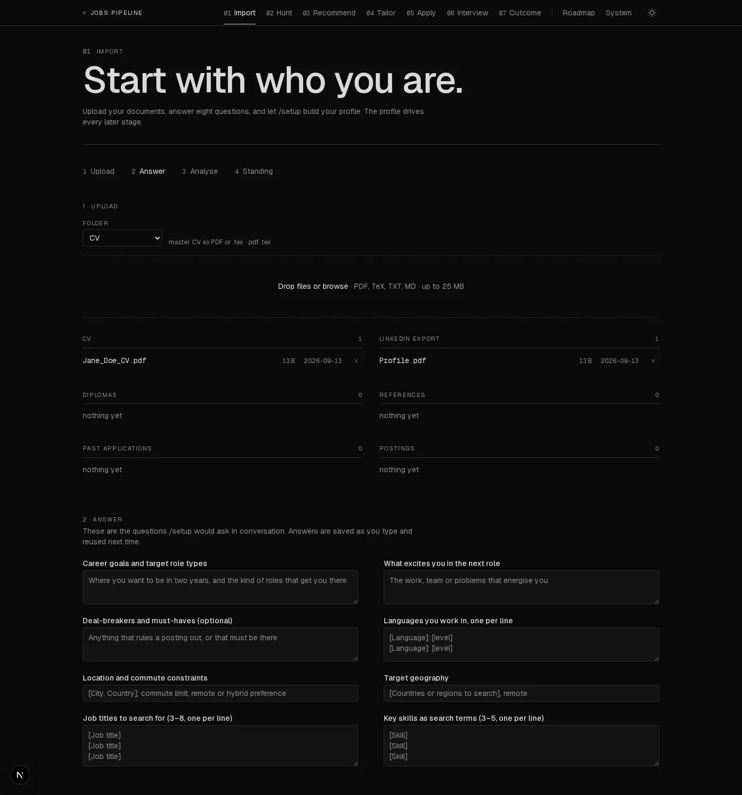 | 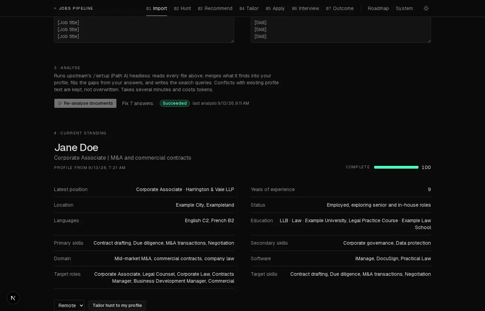 |
| **Hunt**: regions, portals, locations, queries | **Jobs**: every posting seen, filters, scores, statuses |
| 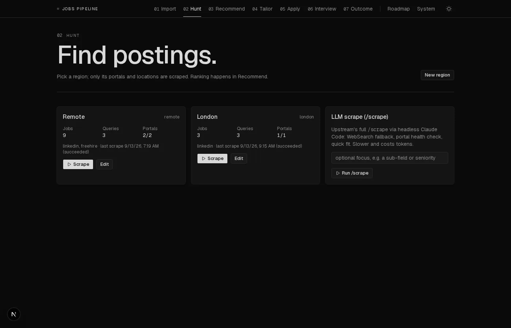 | 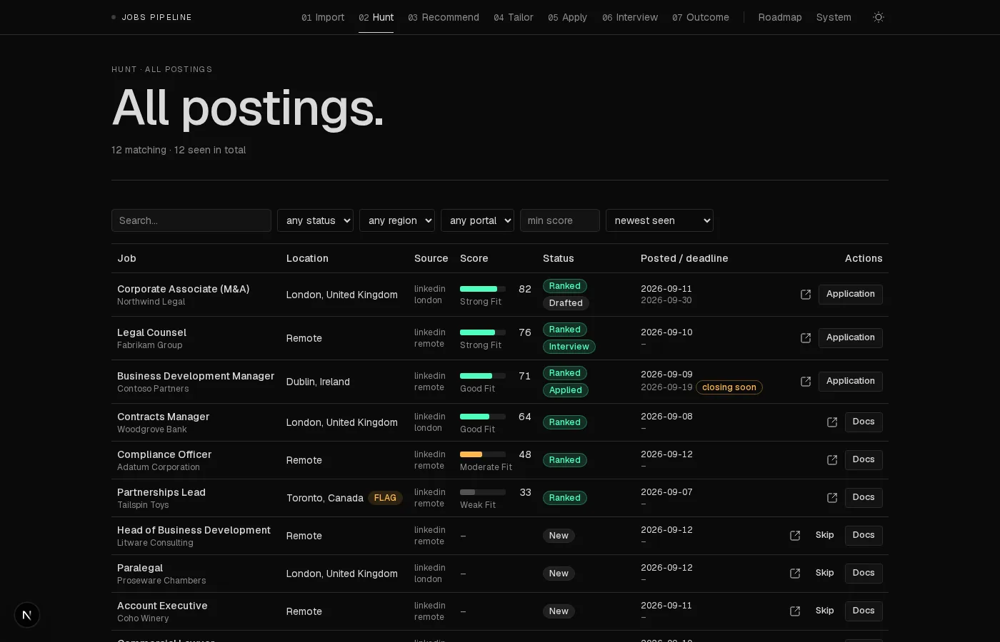 |
| **Recommend**: ranked by fit band | **Job detail**: score, gates, strengths, gaps |
| 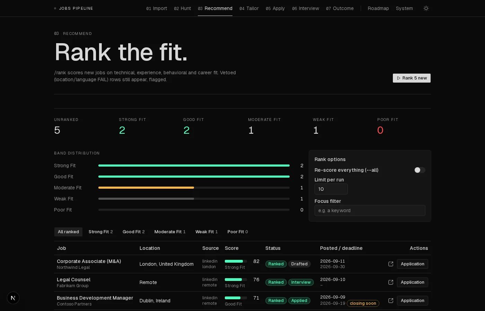 | 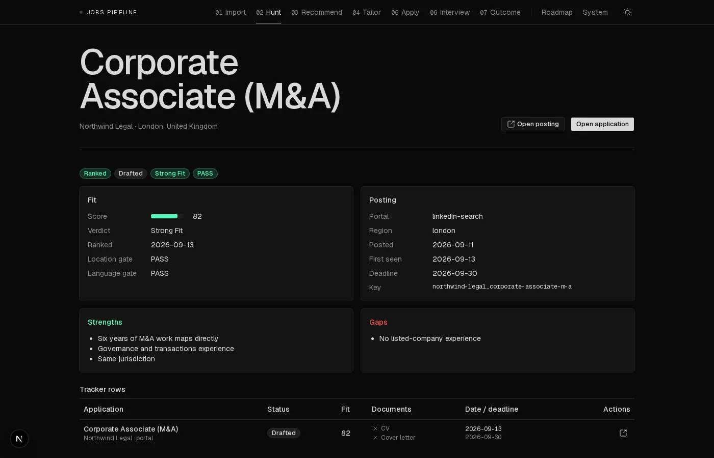 |
| **Tailor**: drafted applications and PDF readiness | **Application**: documents, submit, interview prep, outcome |
| 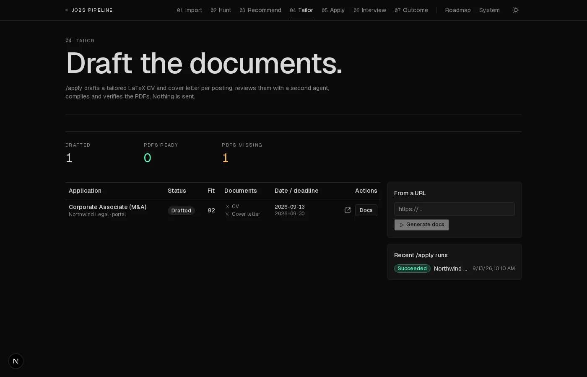 | 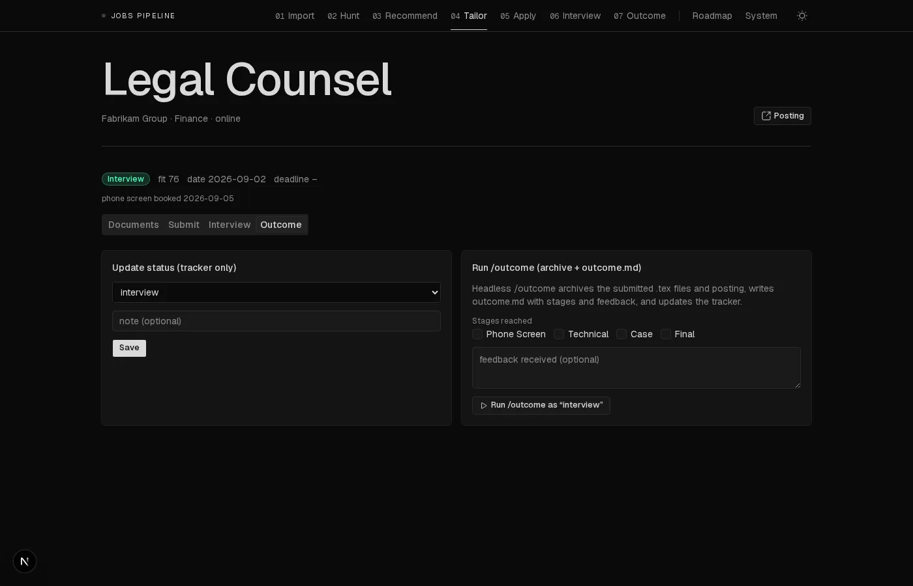 |
| **Outcome**: status funnel and inline updates | **System**: runs with live logs, health, regions, browser |
| 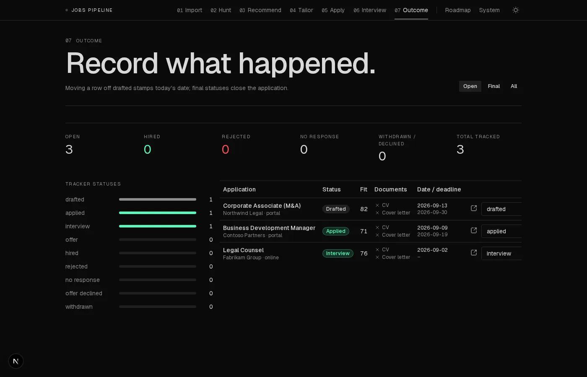 | 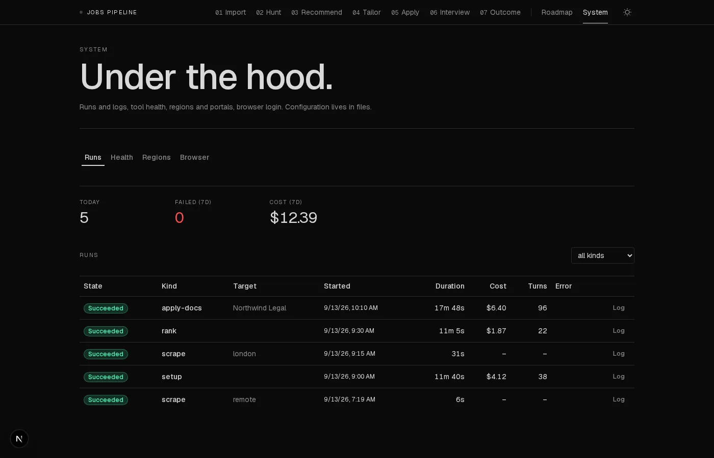 |
| **Roadmap**: past → now → next roles, levers, milestones | **Light theme** |
| 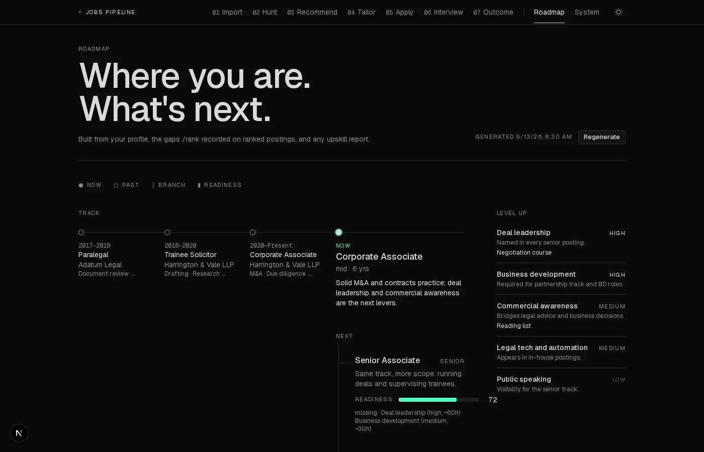 | 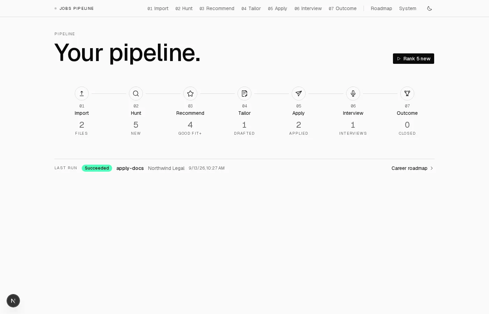 |

## Requirements

- Docker with Compose v2 (Docker Desktop on Windows/WSL2, or Docker Engine on Linux/macOS).
- A Claude subscription (Pro/Max) **or** an Anthropic API key. The AI stages run [Claude Code](https://claude.com/claude-code) headless inside the API container.
- About 7 GB of disk for the API image (TeX Live, Chromium, Node, Bun, Python).
- Optional, for the auto-submit login window on WSL2: WSLg (ships with Windows 11). On Linux, an X server; on macOS, XQuartz, or set `HEADED=0` and log in through a one-off headed run.

You do not need Python, Node, Bun, LaTeX or Claude Code installed on the host; they all live in the containers.

## Quick start

### 1. Fork and clone

```bash
gh repo fork haikalaiman-dev/auto_jobs_pipeline --clone
cd auto_jobs_pipeline
```

> [!IMPORTANT]
> **A fork of this repository is always public**, and the Import step (upstream's `/setup`) writes your personal data (name, contact details, employment history, salary expectations) into **tracked** files. If this copy is for your own job search, do not fork: create a **private repository** and add this one as `upstream` instead. The two-minute recipe is upstream's [SETUP.md section 8](SETUP.md#8-pulling-upstream-updates-into-your-fork); every update path works the same way. Fork only to contribute.

### 2. Authenticate

```bash
cp .env.example .env
```

Either run `claude setup-token` on any machine where Claude Code is logged in and paste the result into `.env` as `CLAUDE_CODE_OAUTH_TOKEN=...`, or set `ANTHROPIC_API_KEY=...` instead. Set `UID` to your user id (`id -u`) so files created by the container stay yours.

### 3. Start

```bash
docker compose up -d --build     # first build takes a while (TeX Live + Chromium)
open http://localhost:3000        # or just browse to it
```

Check **System → Health**: bun, claude, lualatex, xelatex, pdftotext and playwright should all be present. Then:

```bash
docker compose exec api claude -p "say ok" --output-format json --permission-mode bypassPermissions
```

If that prints a result, the AI stages will work. If your organisation's Claude policy disables `bypassPermissions`, see the fallback in [dashboard/README.md](dashboard/README.md#permissions).

## First run

1. **Import.** Upload at least your CV (PDF or `.tex`) and, ideally, your LinkedIn profile export (Profile → More → Save to PDF). Answer the eight questions. Click **Analyse documents**. This runs `/setup` headless for a few minutes and writes your profile into `CLAUDE.md` and the skill files upstream expects. The **Current standing** section fills in when it finishes. Click **Tailor hunt to my profile** to push your target titles and skills into a region's queries.
2. **Hunt.** Regions ship blank. Give the Remote region some queries (or use **Tailor hunt to my profile** on Import), or add a region for your country or city under **New region**, then **Scrape**. Results appear under **Jobs** within seconds.
3. **Recommend.** **Rank** the new postings. Open one to see its score, strengths and gaps.
4. **Tailor.** From a ranked job, **Generate CV + cover letter**. The PDFs appear on the application page when the run finishes.
5. **Apply.** Log in to the portal once under **System → Browser**, then **Dry run** an application to see the filled form as screenshots. Switch dry run off to submit for real, or apply by hand and set the status to *applied* under **Outcome**.
6. **Interview** and **Outcome** as things happen. **Roadmap → Generate** whenever your profile or ranked postings change.

Every long action is a *run*. A banner at the bottom shows what is running; **View log** opens the live log. One run executes at a time.

## Configuration

| What | Where |
|---|---|
| Auth, permission mode, headed browser, your UID | `.env` (see `.env.example`) |
| Regions: portals, locations, flags, default queries | `dashboard/regions.yaml`, or Hunt → region → Edit |
| Which job boards exist and are enabled | `.agents/skills/<board>-search/SKILL.md` (`enabled: false`); add a board for your market with upstream's `/add-portal` |
| Your profile, evaluation rubric, writing style, STAR examples | `CLAUDE.md` and `.claude/skills/job-application-assistant/*.md`, written by Import / `/setup`, editable by hand |
| CV and cover-letter templates | `cv/`, `cover_letters/`, or register your own with upstream's `/add-template` |
| Answers for portal application forms | `dashboard/apply-answers.yaml` (`lowercase question label: answer`) |

The Claude Code commands remain fully usable on their own. Run `claude` in the repo root and use `/scrape`, `/rank`, `/apply <url>` and the rest exactly as [upstream documents](https://github.com/MadsLorentzen/ai-job-search#readme). The dashboard reads and writes the same files, so both views stay in sync.

## Privacy and safety, read before you push

- **Your profile lands in tracked files.** `/setup` writes your name, contact details, employment history and preferences into `CLAUDE.md`, the skill files and `cv/main_example.tex`, all of which are committed. Keep your copy of this repository **private**. This is upstream's guidance too; a public fork of a public repository cannot be made private on GitHub, so clone into a private repository of your own instead of forking.
- **Already ignored, never committed:** `.env`, uploaded documents (`documents/**`), scraped jobs (`job_scraper/seen_jobs.json`), the application tracker CSV, generated CVs and cover letters, PDFs, screenshots, run logs (`dashboard/runs/`), the browser profile with your portal logins, your setup answers, the roadmap JSON, and `dashboard/apply-answers.yaml`.
- **Local only.** The API binds to your machine and serves your documents under `/files`. Do not expose port 8000 or 3000 to a network.
- **Auto-submit breaks portal terms of service.** LinkedIn and SEEK/JobStreet forbid automated applications and may restrict accounts. Volume is kept low and dry-run is the default, but the risk is yours.
- **Costs tokens.** Rank, Tailor, Interview, Outcome, Import analysis and Roadmap each spend Claude tokens; every run records its cost under System → Runs.

## Updating from upstream

Upstream moves quickly. Pull a tagged release rather than raw `master`:

```bash
git remote add upstream https://github.com/MadsLorentzen/ai-job-search.git   # once
git fetch upstream --tags
git merge <tag>          # e.g. the latest release tag
```

Upstream files live at the repo root and are untouched by the dashboard, so merges are usually clean; `README.md` is the one file both sides edit. Afterwards run the checks below.

## Development

```bash
# backend unit tests (needs fastapi, pyyaml, python-multipart on the host, or run inside the api container)
python3 -m unittest discover -s dashboard/api/tests -t .
# upstream's own suite and guards must stay green
python3 -m unittest discover -s tests -t . && python3 tools/lint_skills.py && python3 tools/security_guards.py
# frontend
cd dashboard/web && npx tsc --noEmit && npx eslint .
```

Architecture, API reference, run kinds and troubleshooting: [dashboard/README.md](dashboard/README.md). Upstream's setup guide for the Claude Code workflow: [SETUP.md](SETUP.md).

## Credits and licence

- [ai-job-search](https://github.com/MadsLorentzen/ai-job-search) by Mads Lorentzen, MIT. The framework, commands, skills, templates, tools and tests under the repo root are his work and his contributors'; see [CHANGELOG.md](CHANGELOG.md) and the upstream acknowledgements, including [Mikkel Krogsholm](https://github.com/mikkelkrogsholm/skills) for the portal-search CLIs.
- Dashboard, Docker setup and everything under `dashboard/`, `docker/` and `compose.yaml`: this fork, MIT.
- UI built with [Next.js](https://nextjs.org), [shadcn/ui](https://ui.shadcn.com) on [Base UI](https://base-ui.com), [Tailwind CSS](https://tailwindcss.com) and [Iconoir](https://iconoir.com). The `.claude/skills/ui-skills/` folder vendors [ibelick/ui-skills](https://github.com/ibelick/ui-skills), MIT.
- Backend: [FastAPI](https://fastapi.tiangolo.com) and [Playwright](https://playwright.dev).

Licensed under the MIT License; see [LICENSE](LICENSE).
